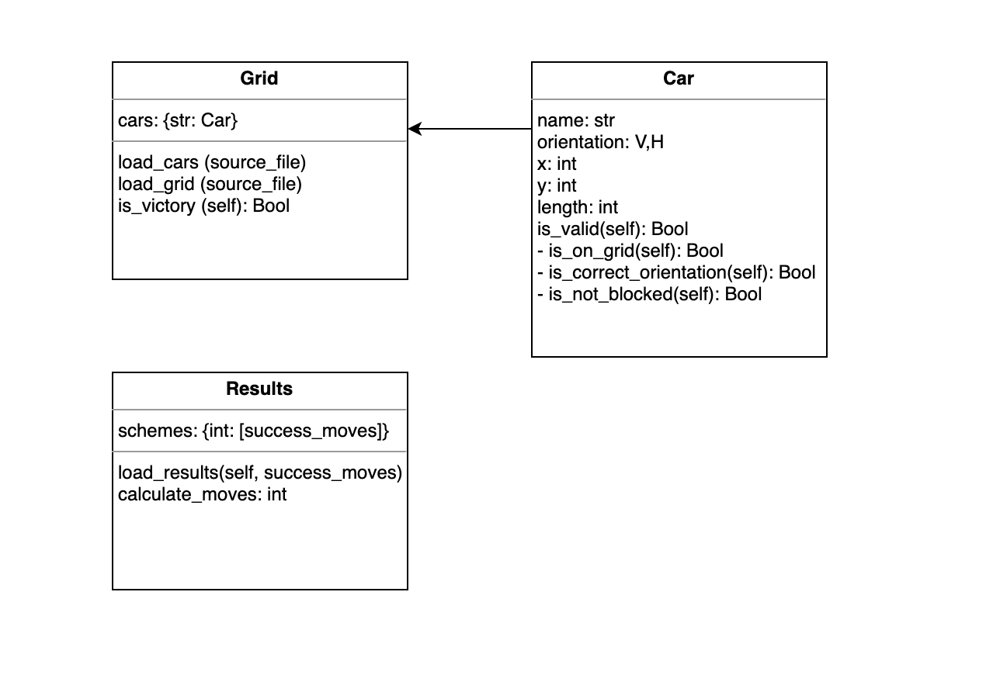

# Rush hour 
<i>Implementation by team: Unjam my Jam</i>

</img>

Rush Hour is a sliding puzzle where the goal is for the red car to reach the exit. However, the route to the exit is blocked by multiple cars and trucks! These obstacles have to be moved around in such a way that the red car is free to exit. The possibilities on solving this puzzle are countless. Our team, Unjam my Jam, explored different algorithms and heuristics to find out how a computer can solve this puzzle as quickly as possible.


### Getting started
After cloning the repository you can open ```main.py``` and find the different algorithms commented out, read next in instructions. After the required imports are installed, see requirements.txt, the code can be run using either: ```python main.py``` or ```python3 main.py```.


### Instructions
You can start exploring by uncommenting different algorithms. Each algorithm is clearly stated using a long string with the algorithm name in the middle. If the algorithm is not commented out, it will run. Make sure only one algorithm is used at a time (unless it's a combination of an algorithm with hillclimber and or visualisation). In your terminal the final board and the amount of moves to solve this will pop up and a CSV file with the relative moves.
The various boards can be selected by changing the map name in ```python main.py```.
N.B.: The algorithm ```hillclimber.py``` can only be run after running another algorithm first. Since it uses the original solution to optimize it. 
The file ```main.py``` concludes with *Visualisation*, if this has run a GIF of the board will be available in *visualisation/boards*.

</img>

*Example of solving the Depth First Search algorithm*

### Structure
The Git repository is structured as follows:
* **/code**: contains all the code for this project
    *  **/code/algorithms**: code for algorithms

        * **Beam_search.py**: solves the board by scoring different permutations of a board, giving higher scores to boards that have a higher likelihood to help the red car drive to the exit. It then removes the permutations, or children, with the lowest score. This algorithm uses the heuristic blocked cars (see *code/heuristics*).

        * **Best_first.py**: also solves the puzzle by assigning a score to the different permutations of a board to help the red car exit. However, this algorithm chooses the best children from the options and gives them priority without removing the rest. This algorithm uses the heuristic Block_Cars (see *code/heuristics*). This algorithm uses the heuristic blocked cars (see *code/heuristics*).

        * **Breadth_first.py**: solves the board by checking each generation horizontally, from left to right, to find the shortest path as possible.

        * **Depth_first.py**: solves the board by checking the generations vertically. It selects the first possible next state of the original board and then the next state of that board until a solution is reached or there are no more states to check.

        * **Hillclimber.py**: shortens the found path by using a local breadth first on a part of the found path for a number of iterations. 

        * **Randomise.py**: solves the board by randomly finding empty spots and moving random cars towards it, until the red car is at the exit.

        * **State_space.py**: explores all possible child states using a breadth first algorithm.

    * **/code/classes**: contains a car, grid and visualisation class.

        * **Car.py**: model that includes the specifications of each car on the board. 

        * **Grid.py**: model that describes how the cars are put into a visible grid.

        * **Model.py**: model that allows functions to modify boards. 

        * **Visualisation.py**: model that changes a series of boards from 2D strings to a user-friendly graph and GIF. 
    
    * **/code/heuristics**: heuristics for algorithms

        * **Advanced_block_bf.py**: A heuristic that combines that scores possible permutations of a certain board by attributing points for position towards the exit, amount of cars blocking the red car's exit, and taking into account the ability for the cars that block the red car, to move from their position. The output is a tuple so the scores can be put into a priority queue to accomodate the best first algorithm.

        * **Advanced_block_bs.py**: Some heuristic as Advanced_block_bf with a different output to accomodate the beam search algorithm. 

* **/data**: contains different sizes for seven boards and the starting positions of cars.
    * Three boards of 6 by 6.
    * Two boards of 9 by 9.
    * One board of 12 by 12.

* **/doc**: contains different documents for code
    * An UML diagram of the classes:

    </img>

    * Example GIF

### Authors
* Mila Sparreboom: [MSparreboom](https://github.com/MSparreboom)
* Julius Kemmer: [Juliuskem](https://github.com/juliuskem)
* Mayla Kersten: [himayla](https://github.com/himayla/)