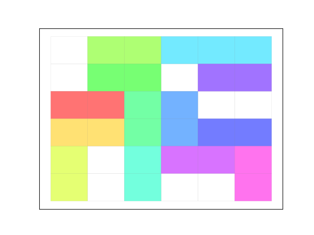

# Rush hour 
<i>Implementation by team: Unjam my Jam</i>
</img>

Rush Hour is a sliding puzzle where the goal is for the red car to drive to the exit. The exit is however blocked by multiple cars and trucks. 
This repository includes our research in the exploration of algorithms and heuristics to find out how this puzzle can be solved as quickly as possible.

### Getting started
After cloning the Git repository you can open ```main.py``` and find the different algorithms commented out. You can start exploring by uncommenting algorithms, change the different boards sizes and run either:
```python main.py``` or ```python3 main.py```.
The file ```main.py``` concludes with *Visualisation*, if this is run a GIF of the board will be available in **visualisation/boards**:


### Structure
The Git repository is structured as follows:
* **/code:**: contains all the code for this project
    *  **/code/algorithms**: code for algorithms
        * Best_first.py: solve the board by sorting the children based on their score.
        * Beam_search.py: solve the board by removing children based on their score.
        * Breadth_first.py: solves the board by checking each generation from left to right (horizontally).
        * Depth_first.py: solves the board by checking the generations vertically. It selects the first possible next state of the original board and then the next state of that board until a solution is reached or there are no more states to check. 
        * Randomise.py: solves the board by finding empty spots and moves cars there until car X is at final destination.
    * **/code/classes**: contains a car, grid and visualisation class.
    * **/code/heuristics**: heuristics for algorithms

* **/data**: contains different sizes for seven boards and the starting positions of cars.
    * Three boards of 6 by 6.
    * Two boards of 9 by 9.
    * One board of 12 by 12.

* **/doc**: contains different documents for code
    * A UML diagram of the classes:
    

    * Example GIF

### Authors
* Mila Sparreboom
* Julius Kemmer
* Mayla Kersten