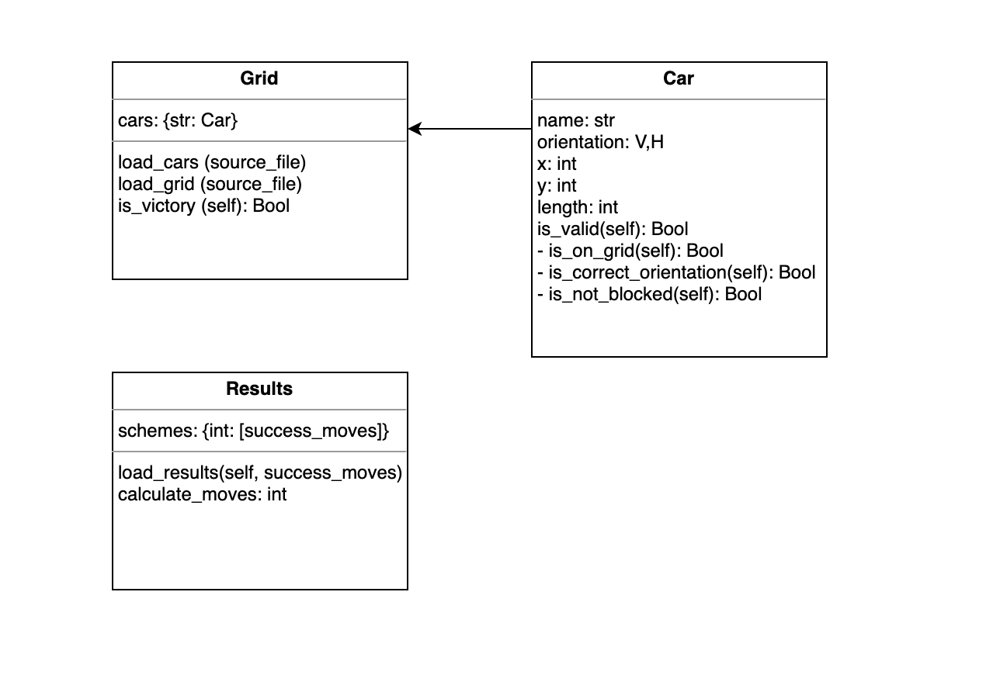

# Rush hour 

<i>Implementation by team: Unjamming my Jam</i>

Rush Hour is a logic game where the goal is to slide the cars in such a way that car (X) is free to drive to the exit. 
This code aims algorithimically solve this puzzle using the fewest amount of moves. To achieve this we have set ourselves the following sub-goals:

- [x] Read data from CSV-file
- [x] Visualise data in a grid
- [ ] Algorithm which generates random solutions
- [ ] First algorithm 
- [ ] Second algorithm
- [ ] Find the quickest the solution

### Getting started
The code is written in Python. It has the following main Object Oriented structure:

After cloning the Git code you can run a board by running:
```python main.py```. A visualisation will be shown in the terminal as well as in a pop-up.

### Structure
The Git repository is structured as follows:
* /code: all code of this project
    * /code/algorithms: code for algorithms
    * /code/classes: contains a car and a grid class.
* /data: contains different starting positions from cars to fill a grid


### Authors
* Mila Sparreboom
* Julius Kemmer
* Mayla Kersten

Our group currently uses [this](https://drive.google.com/drive/folders/1weqj6__kEpObx-_6V2E9ijmGJZKb-iqt) folder to work in.
