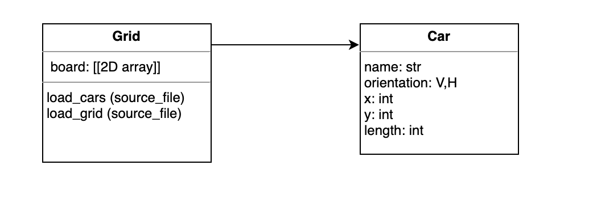

# Rush hour 
<i>Implementation by team: Unjam my Jam</i>

</img>

Rush Hour is a sliding puzzle where the goal is for the red car to reach the exit. However, the route to the exit is blocked by multiple cars and trucks. These obstacles have to be slided in such a way that the red car is free to exit.
Our team Unjam my Jam explored different algorithms and heuristics to find out how a computer can solve this puzzle as quickly as possible.


### Getting started
After cloning the repository you can open ```main.py``` and find the different algorithms commented out. You can start exploring by uncommenting different algorithms, change the different boards sizes and run either: ```python main.py```.
The file ```main.py``` concludes with *Visualisation*, after this has run, a GIF of the board will be available in *visualisation/boards*:

</img>


### Structure
The Git repository is structured as follows:
* **/code**: contains all the code for this project
    *  **/code/algorithms**: code for algorithms

        * Beam_search.py: solves the board by scoring different permutations of a board, giving higher scores to boards that have a higher likelihood to help the red car drive to the exit. It then removes the permutations, or children, with the lowest score. This algorithm uses the heuristic blocked cars (see *code/heuristics*).

        * Best_first.py: also solves the puzzle by assigning a score to the different permutations of a board to help the red car exit. However, it chooses the best children from the options and gives them priority without removing the rest. This algorithm uses the heuristic Block_Cars (see *code/heuristics*). This algorithm uses the heuristic blocked cars (see *code/heuristics*).

        * Breadth_first.py: solves the board by checking each generation horizontally, from left to right, to look for the shortest path as possible.

        * Depth_first.py: solves the board by checking the generations vertically. It selects the first possible next state of the original board and then the next state of that board until a solution is reached or there are no more states to check. 

        * Randomise.py: solves the board by finding empty spots and moves cars towards it, until the red car is at the exit.

    * **/code/classes**: contains a car, grid and visualisation class.
        * Car.py:
        * Grid.py:
        * Model.py
        * Visualisation.py
    
    * **/code/heuristics**: heuristics for algorithms
        * Advanced_block_bf.py
        Advanced_block_bs.py

* **/data**: contains different sizes for seven boards and the starting positions of cars.
    * Three boards of 6 by 6.
    * Two boards of 9 by 9.
    * One board of 12 by 12.

* **/doc**: contains different documents for code
    * An UML diagram of the classes:
    </img>
    * Example GIF

### Authors
* Mila Sparreboom: [MSparreboom](https://github.com/MSparreboom)
* Julius Kemmer: [Juliuskem](https://github.com/juliuskem)
* Mayla Kersten: [himayla](https://github.com/himayla/)